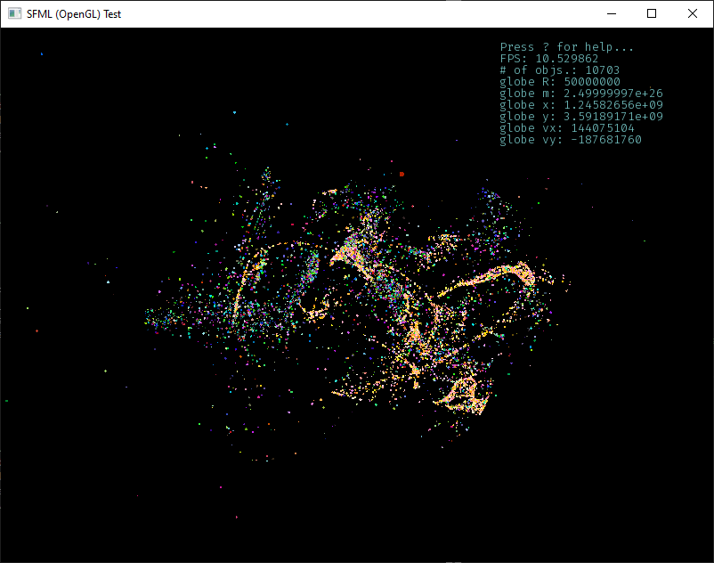
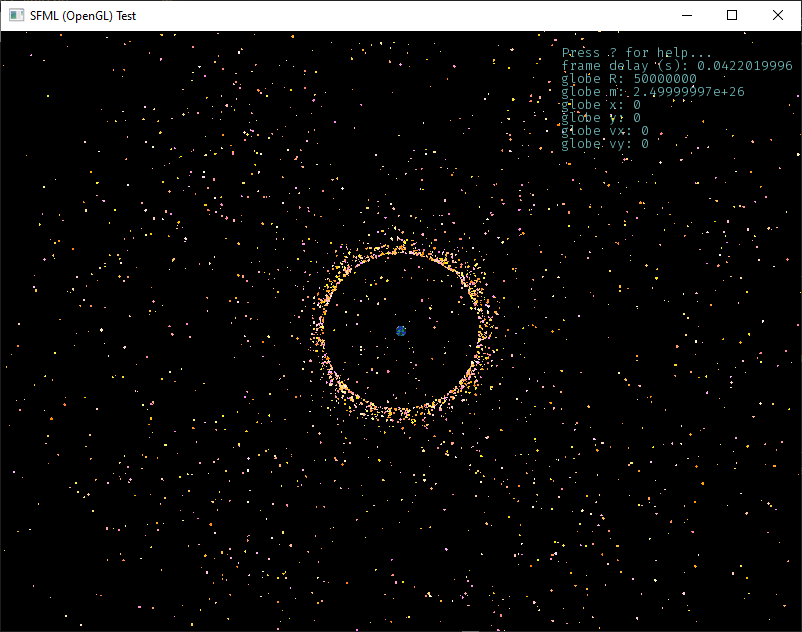
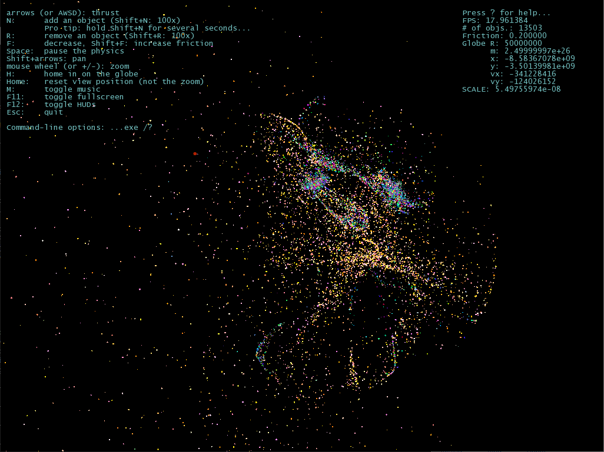

Growing from a simple SFML trial prototype created for a) learning the lib,
b) learning how to architect around frame-based low-level graphics for games
or visual sims.), c) hopefully distilling a simple framework/toolkit for
developing apps that need this sort of a platform, d) even more vaguely:
perhaps actually developing something interesting out of it -- now it's
gradually becoming a minimalist cosmic world-building simulation toy (maybe
even a proper game, later).

Even though its presentation is "offensively" minimalist, and its control
set is also incredibly limited -- basically just a single moving body that
can spawn free-floating other bodies, plus the "metaphysical" manipulation
of some fundamental parameters of its simplified Newtonian physics -- it's
already complex enough to produce an endless flow of rich semi-chaotic
emergent formations, and to inspire fascinating ideas...

Which I'm chock-full of already, and can hardly wait to get through some
boring and/or daunting architectural design + low-level tech hurdles first,
and start crafting the fun bits. You can't wait! ;)

------------------------------------------------------------------------------

Technical & other details: -> [doc/...](doc/)

_(BTW, the screenshots are getting obsolete fast. I've been updating them 
occasionally, however, they can't convey the fist-hand experience of actually
manipulating the wolrd, or even just watching the mesmerizing flow and constant
development of interesting superstructures -- just like in the real universe.)_

------------------------------------------------------------------------------

------------------------------------------------------------------------------

