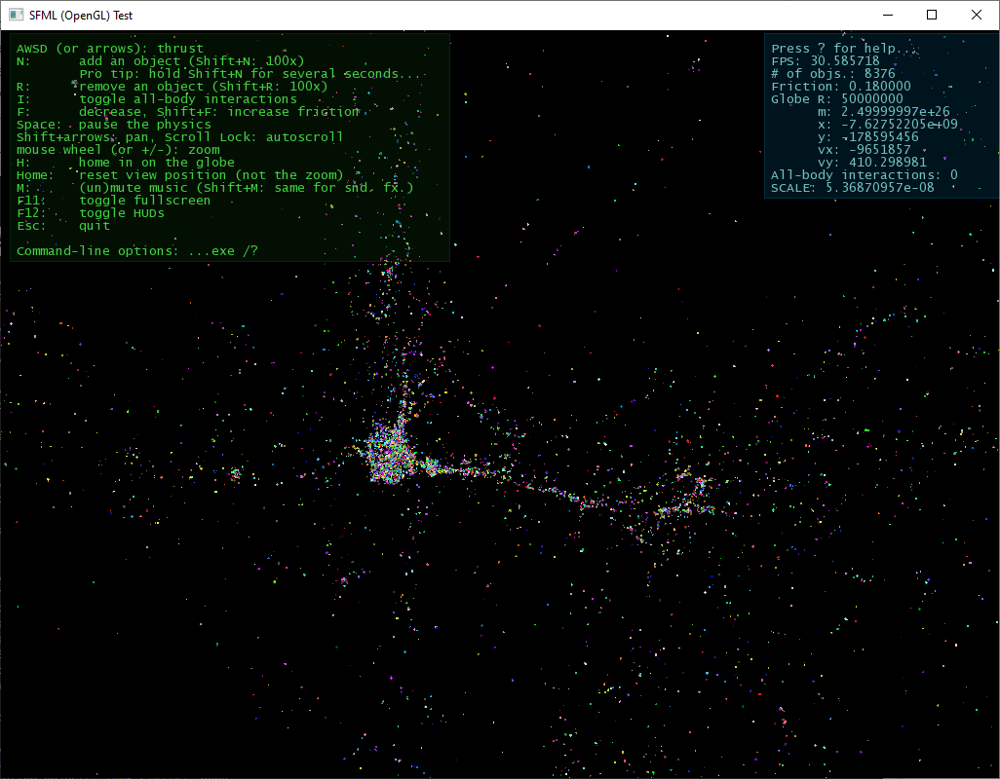
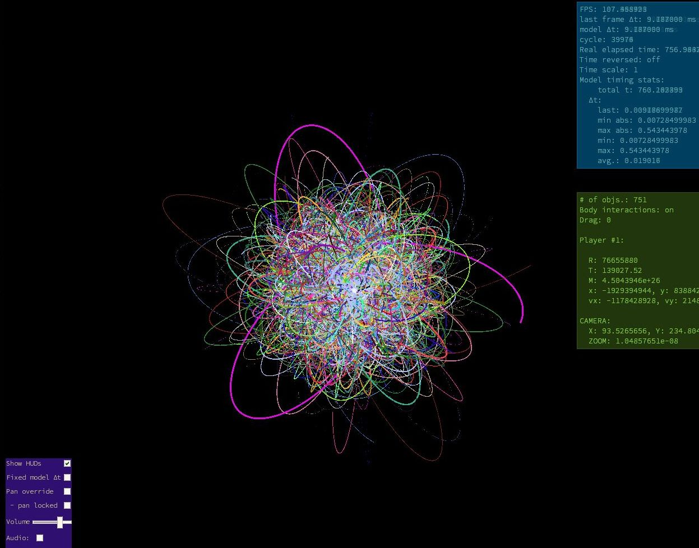

_(See also https://github.com/xparq/Out_of_Nothing/wiki For some more "nimble" notes!)_

Growing from a simple SFML trial prototype created for a) evaluating the lib,
b) learning how to implement visual simulations (or games) around frame-based,
GPU-oriented graphics (which I've never done before), c) hopefully distilling
a simple toolkit for developing apps that need this sort of foundations -- now
it's gradually becoming an engine/framework with the goal of running a broad
range of interactive entity-based simulations, and even simple games.

The project is driven by the development of an MVP/test app: a bare-bones
multiplayer world-building game in a quasi-Newtonian space of interacting
bodies. This concept is simple to design and implement, yet hopefully rich
enough to reveal all the important requirements and technical building blocks
necessary for the engine/framework to be useful for other sim. apps, too.
It's also a beacon: it helps refining the goals/directions of the project.
(And, crucially, it has been fun enough to keep me going.)

In its current (still largely prototype) form its presentation is offensively
crude, its controls are suboptimal, features mostly nonexistent -- it's just
a single steerable body, basically, which can spawn free-floating other bodies
in various configurations, plus some ways to manipulate the attributes of its
simple physics --, but it's already complex enough to yield an endless flow
of interesting semi-chaotic emergent formations, and inspire further ideas.

...Which I'm chock-full of already, and can hardly wait to get through (the
mountains of) boring/daunting architectural design + low-level tech hurdles,
and then finally start crafting the fun bits...

------------------------------------------------------------------------------

Technical & other details: -> [doc/...](doc/)

_(BTW, the screenshots are getting obsolete fast. I've been updating them 
occasionally, however, they can't convey the fist-hand experience of actually
manipulating the wolrd, or even just watching the mesmerizing flow and constant
development of interesting superstructures -- just like in the real universe.)_

------------------------------------------------------------------------------

------------------------------------------------------------------------------

------------------------------------------------------------------------------

